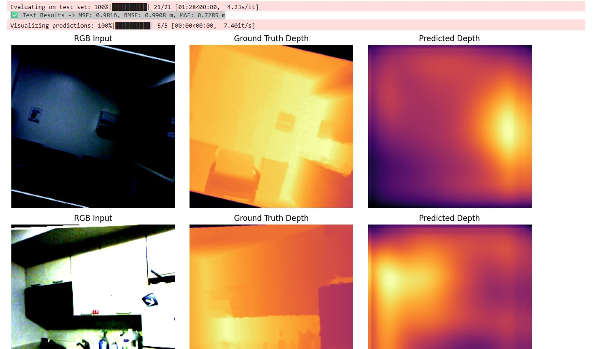
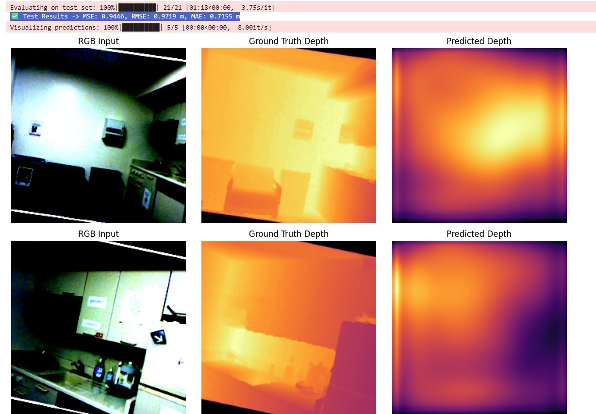
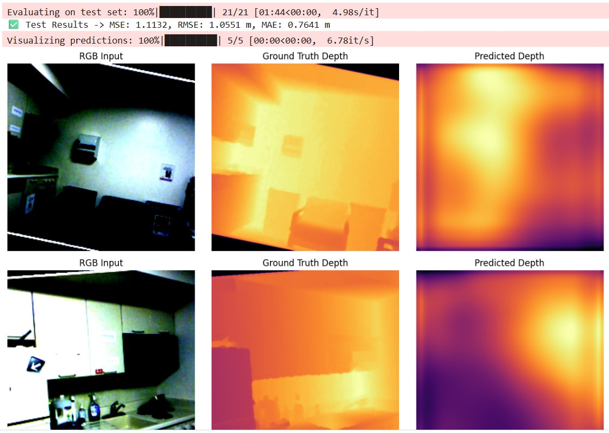

This project implements a depth prediction model that estimates depth maps from RGB images using a pretrained EfficientNet backbone and a simple decoder. It supports data augmentation, EMA, and custom loss functions for robust training. Trained on NYU's Depth V2 for Indoor Color and Depth images.

Features Include: 
RGB-to-depth prediction

Curriculum-based depth augmentation

Huber + Scale-invariant loss

EMA for stable training

Cosine LR scheduler with warmup

Easy deployment with Flask API

Process Throughout Model Training:

First Model:
    The first model was a baseline depth prediction network built on top of a pretrained EfficientNet-B3 encoder from the timm library.

    Encoder: EfficientNet-B3 (pretrained, features_only=True) to extract multi-scale feature maps.

    Decoder: A simple CNN + upsampling stack that gradually reconstructs a single-channel depth map from the encoder’s final feature map.

    Input: RGB image (224×224).

    Output: Depth map (224×224, in meters).

    Training setup:
        Loss Function: MSELoss (per-pixel regression).
        Optimizer: Adam with different learning rates for head-only training and fine-tuning.
        Scheduler: ReduceLROnPlateau (adjust learning rate on plateaued validation loss).

        5 epochs traing the head without using backbone.
        25 epochs FineTuning with backbone.
    
    Results:

