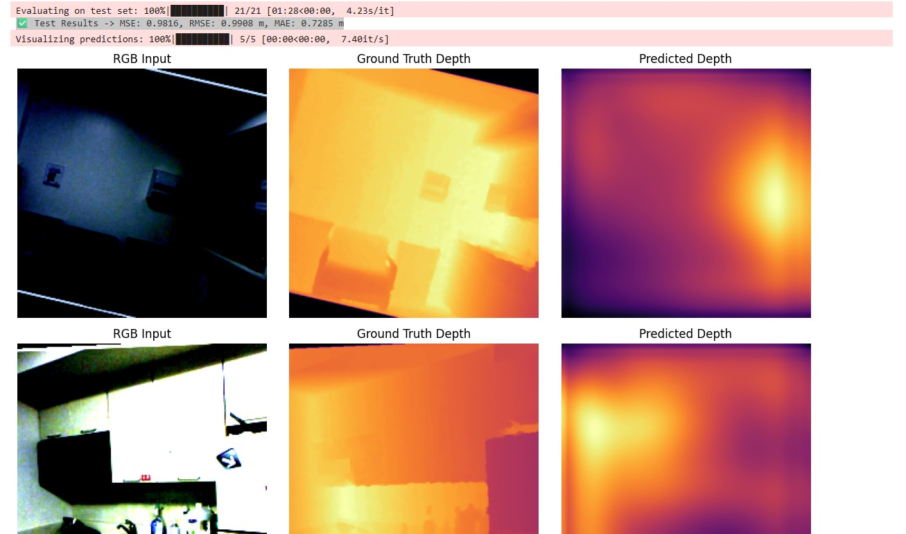
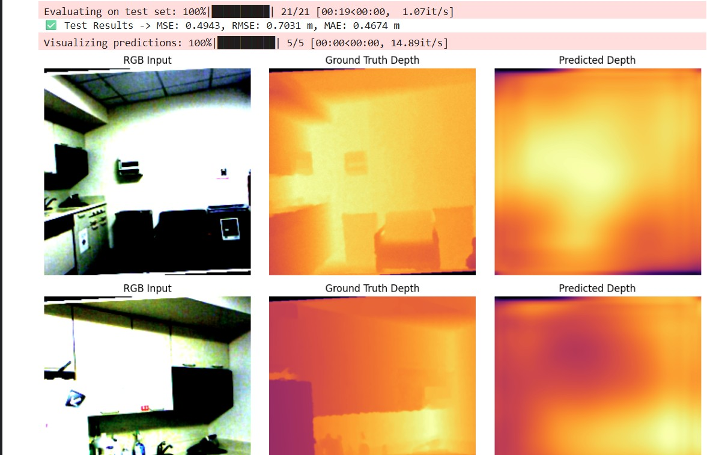

I built a monocular depth estimation system trained on Kaggle using an EfficientNet-B4 encoder and a lightweight decoder. My training strategy combines curriculum fine-tuning, balanced losses (RMSE + MAE + edge-aware smoothness), and modern optimization techniques (AdamW, cosine LR schedule, EMA, mixed precision) to produce accurate depth maps up to 10 meters.

After training, I exported the PyTorch model to ONNX, making it lightweight and portable. The ONNX model is then loaded directly in the browser using ONNX Runtime Web, enabling fast, client-side inference without a backend server.

To make the model accessible, I built a React web app (hosted on GitHub Pages - https://mitcheltu.github.io/DepthPredict/) where users can upload RGB images and instantly see predicted depth maps in their browser.

Process Throughout Model Training:

Depth Prediction Model – Version 1 (❌ Wrong)
    Overview:
     - Uses EfficientNet-B3 encoder (timm) and a simple CNN decoder with upsampling to predict depth maps.
     - Trains in two stages: freeze encoder → train decoder → fine-tune full model.

    Dataset:
     - Loads paired colors/ and depths/.
     - paired_transform keeps RGB/depth aligned with flips, crops, rotations.
     - Depth scaled to meters, clamped to 10m.

    Issues:
     - Code bug: T.ToTensor() used but T never imported → dataset breaks if no transform.
     - Weak decoder: only uses last encoder feature map, ignores multi-scale info.
     - Loss choice: plain MSE, not scale-invariant (bad for depth).
     - Naming: saves model as "depth_classifier.pth" (confusing).
    
    Results:

Depth Prediction Model – Version 2 (❌ Wrong)
    Overview

    Same base: EfficientNet-B3 encoder + simple CNN decoder.
     - Adds better training setup:
             -- Custom DepthLoss (Huber + scale-invariant log loss).
             -- AdamW + cosine LR schedule + warmup.
     - EMA (Exponential Moving Average) of weights.
     - Mixed-precision (torch.amp).
     - Stronger data augmentations on depth maps (noise, dropout, gamma, blur).

    Issues
     - Decoder is still weak → only uses last encoder layer, missing skip connections.
     - Augmentations are too heavy on depth maps → can introduce unrealistic noise and destabilize training.
     - EMA handling is added but not always beneficial if decoder is underpowered.
     - Complexity increased, but core architecture problem (decoder) still unsolved.

👉 This version fixes training/loss issues from V1 but still fails to deliver strong predictions due to decoder limitations.

    Results:

Depth Prediction Model – Version 3 (✅ Best)
    Overview
     - Uses EfficientNet-B4 encoder (timm) with features_only=True → gives multi-scale feature maps.
     - Simple but stronger decoder with upsampling to predict dense depth maps. 
    
    Trains in two stages:
     - Train decoder with frozen encoder.
     - Gradually unfreeze encoder layers for fine-tuning.

    Training Setup
     - Loss: RMSE + MAE (balanced) + edge-aware smoothness.
     - Optimizer: AdamW with different LR for encoder/decoder, cosine LR schedule, warmup.
     - EMA for stable validation.
     - Mixed precision + gradient clipping.
    
    Data handling:
     - paired_transform keeps RGB/depth aligned.
     - Depth values normalized to meters, clipped at 10m.
     - Validation uses deterministic preprocessing.

    Strengths vs Previous Versions:
     - Fixed transform issues (cleaner handling of RGB + depth).
     - Better loss design: scale-aware and smoothness-aware → more realistic depth.
     - Curriculum fine-tuning: freezes encoder, then gradually unfreezes → stable training.
     - Post-processing ready (median + Gaussian smoothing), though disabled by default.

     Results:
